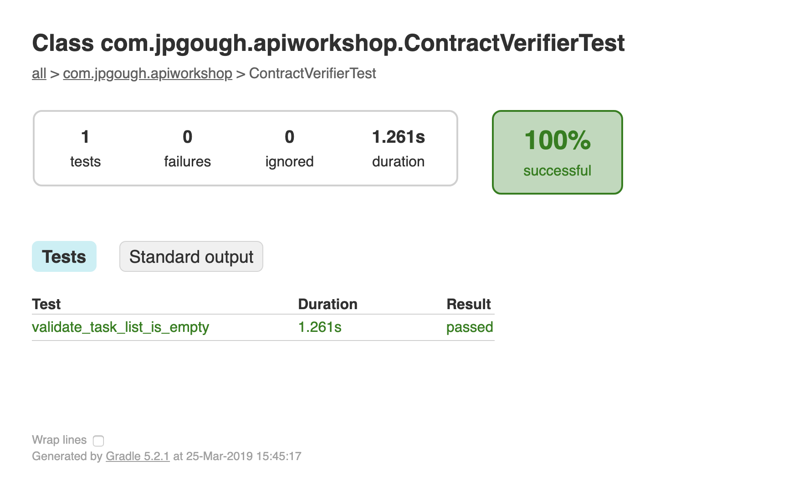
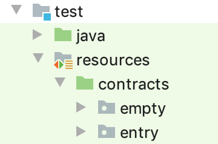

# Lab 2 Contracts

In lab 1 we created an API for tracking a todo list. 
One thing you may have felt whilst writing the code was the requirement to do manual testing.
In this lab we will explore writing Contract Driven Tests for our todo list application.

#### Lab 1 Recap

Before we start it's important to scope what should have been done in lab 1 (in an ideal solution/world).

* A `Todo` Controller should have been created and unit tested for accuracy
* The `Todo` Controller should have implemented the GET, POST and DELETE behaviour described in [Lab 1](../01-spring-boot/README.md).

### Step 1 - Configuring Spring Cloud Contracts

As always it's probably a good idea to commit the work from the previous lab if you have not already.
In our `build.gradle` you will need to check that you have the following dependencies
The `classpath "org.springframework.cloud:spring-cloud-contract-gradle-plugin:2.1.2.RELEASE"` is a gradle plugin to allow us to work with Spring Cloud Contracts. We need to import the plugin and the declare we are using it by adding `apply plugin: 'spring-cloud-contract'`

This should appear in the buildscript as follows, if it done not then copy the configuration in
```groovy
buildscript {
	repositories {
		mavenCentral()
	}
	dependencies {
		classpath "org.springframework.boot:spring-boot-gradle-plugin:2.1.7.RELEASE"
		classpath "org.springframework.cloud:spring-cloud-contract-gradle-plugin:2.1.2.RELEASE"
	}
}
apply plugin: 'spring-cloud-contract'
```


The `testImplementation 'org.springframework.cloud:spring-cloud-starter-contract-verifier'` is the Spring Cloud Contract verifier, it generates tests to confirm your application conforms to the pacts (contracts).
	
This should appear in your dependencies as follows

```groovy
dependencies {
	implementation 'org.springframework.boot:spring-boot-starter-web'
	testImplementation 'org.springframework.boot:spring-boot-starter-test'
	testImplementation 'org.springframework.cloud:spring-cloud-starter-contract-verifier'
}
```

Great we are all setup to write our first contract

### Step 2 - Writing your first contract

* Create a folder called `resources` under the test directory
* Inside the `resources` directory create a directory called `contracts`, this is where our contract tests will live.
* Create our first contract inside the `contracts` folder

`todo_list_is_empty.groovy`

```groovy
org.springframework.cloud.contract.spec.Contract.make {
    request {
        method 'GET'
        url '/todos'
    }
    response {
        status 200
        body([])
    }
}
```
The file represents a DSL specified in groovy for defining a contract. 
One of the first manual tests we performed in our previous lab was to check the todos are initially empty. 

Now we have our contract we need to provide some setup to run this.

### Step 3 - Creating the Basis for the Test

We need to setup a class that knows our `TODO` controller is the subject under test.
Let this sink in and how it makes sense. We write a contract to define what interactions should happen. However, we need to configure the parts of the application that are going to verify the pacts 

Lets do this by creating a class called `ContractBase.java`, which we prepare to be the basis for running our contracts.

```java
package com.jpgough.apiworkshop;

import com.jpgough.apiworkshop.controller.TodosController;
import io.restassured.module.mockmvc.RestAssuredMockMvc;
import org.junit.Before;

public abstract class ContractBase {

    TodosController todoController = new TodosController();

    @Before
    public void setup() {
        RestAssuredMockMvc.standaloneSetup(this.todoController);
    }
}
```

You may have noticed a couple of things, this is an `abstract class` and only contains a `@Before` annotation and no actual tests.
The tests are going to be generated from the contracts we have specified and the generated test will extend this base class

The final step is to return to our `build.gradle` and point to our base class for testing

```groovy
contracts {
	baseClassForTests = 'com.jpgough.apiworkshop.ContractBase'
	// fully qualified name to a class that will be the base class for your generated test classes
}
```

### Step 4 - Running the Tests and Checking the Output

The final step is to run the tests and view the results. 
We can do this by running `gradle test` and if everything works we should see a successful build.
In the directory `build/reports/tests/test` there is an `index.html` file that can be loaded in a browser to view the results of our tests.


The results show us our two tests, the config test provided from SpringInitializr and our new contract test.
We can drill into the test in more details.



In the directory `build/generated-test-sources` we can find the test that was generated and executed

```java
public class ContractVerifierTest extends ContractBase {

	@Test
	public void validate_todo_list_is_empty() throws Exception {
		// given:
			MockMvcRequestSpecification request = given();

		// when:
			ResponseOptions response = given().spec(request)
					.get("/todo");

		// then:
			assertThat(response.statusCode()).isEqualTo(200);
		// and:
			DocumentContext parsedJson = JsonPath.parse(response.getBody().asString());
	}
}
```

It is worth keeping an eye on this folder as we go through the next part of the workshop. 
If a test doesn't work as expected you may have to take a look in this file to check the test is as expected and it is sometimes worth running `gradle clean` to clear out the folder to force regenerating the test.
You can also execute the tests from this directory in your IDE.

It is also worth noting that this is using [Rest-assured](http://rest-assured.io) behind the scenes, another good mechanism for fine grain control when testing APIs. 

### Step 5 - Adding More Tests

Our `ContractBase.java` allows us to cover a lot of negative test cases.
When we use all the other requests we should see some failures.
Try and add tests for the following API edge cases:

* `GET /todos/1` - Should return a 404, as an item does not exist
* `DELETE /todos/1` - Should return a 404, as an item does not exist
* `POST /todos` - Should return a 201 as the item does not exist


### Step 6 - Extensions

This extension is a little tricky as it now requires us to have a different starting state.
At this stage `ContractBase.java` should refactor to `EmptyBase.java` and we need to create a new base class `ExistingBase.java`

```java
public abstract class ExistingBase {

    private TodosController todoController = new TodosController();

    @Before
    public void setup() {
        RestAssuredMockMvc.standaloneSetup(this.todoController);
        todoController.createNewTodo(new Todo("Mkae the bed")); // Yes this is on purpose ;) Check Step - 7
    }

}
```
It is possible to setup mappings to pick up different base classes for test types.
The documentation for this can be found [here](https://cloud.spring.io/spring-cloud-contract/reference/htmlsingle/#how-to-protocol-convention-producer-with-contracts-stored-locally).

We will need to crete two packages in our contracts to hold contracts for tests that have no pre created todo entries and tests that have pre created todo's



Then configure the build.gradle to specify where the base classes exist

```gradle
contracts {
//     Base class mappings etc.
    packageWithBaseClasses = "com.jpgough.apiworkshop.contract"
}
```

The scenarios we can now test include

* Trying to add a todo that already exists
* Getting todos includes todo 1
* Retrieval of todo 1 succeeds with the description and a 200
* Todo 1 can be removed successfully 

It is also possible to have multiple tests executed together in scenarios using Spring Cloud Contract.


### Step 7 - Extension 2

A Consumer wants to add additional functionality to the Producer. They create a contract that they want the producer to fulfil.
There is an application called a [Pact Broker](https://docs.pact.io/getting_started/sharing_pacts) which is a allows Consumers to push contracts to and Producers to pull.

We are going to generate the contract by performing the following
```shell
cd consumer-code
./gradlew test
```

This will bring up a Pact broker and push a contract. You can now see this by visiting http://localhost:8085


So we have a contract that should be fulfilled

To pull in this contract for the Producer a bit of configuration is required as it we need to specify that we are using the pact broker to for our contracts.

The Pact Broker plugin (`classpath "org.springframework.cloud:spring-cloud-contract-pact:2.1.2.RELEASE"`) is required in the buildscript
```groovy
buildscript {
    repositories {
        mavenCentral()
    }
    dependencies {
        classpath "org.springframework.boot:spring-boot-gradle-plugin:2.1.7.RELEASE"
        classpath "org.springframework.cloud:spring-cloud-contract-gradle-plugin:2.1.2.RELEASE"
        classpath "org.springframework.cloud:spring-cloud-contract-pact:2.1.2.RELEASE"
    }
}
```

We also need to configure where the pact broker lives
```groovy
contracts {
	baseClassForTests = "com.jpgough.apiworkshop.contract.ExistingBase"
//    When + is passed, a latest tag will be applied when fetching pacts
    contractDependency {
        stringNotation = "com.jpgough.apiworkshop:todo-api-producer-pact:+"
    }
    contractRepository {
        repositoryUrl = "pact://http://localhost:8085"
    }
    contractsMode = "REMOTE"
}
```

Run `gradle test` and you should now be pulling in the contract and have a failing test.


What is the contract asking for? The task is to edit the TODO controller and fulfil the PUT request to edit a TODO and return a 204.


### Where can I find more?
You can check out lots of [spring cloud contracts](https://spring.io/projects/spring-cloud-contract#overview) examples at the github page: https://github.com/spring-cloud-samples/spring-cloud-contract-samples
